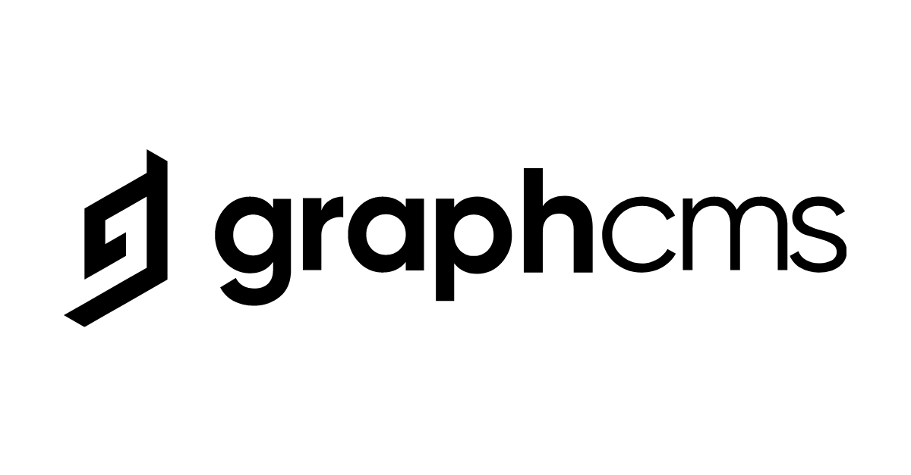

<p align="center">
  <a href="https://graphcms.com/" target="blank"></a>
</p>

<h1 align="center">
   <a href="#"> Event Plataform </a>
</h1>

<h3 align="center">
    It's just a project for study!
</h3>

<p align="center">
  

  

  <a href="https://github.com/zEduardofaria/event-plataform/commits/master">
    
  </a>

   
   <a href="https://github.com/zEduardofaria/event-plataform/stargazers">
    
  </a>
</p>

<h4 align="center">
	 Status: Finished
</h4>

```
⚠️ WARNING
  - This project does not reflect my code pattern for my own projects;
  - I usually use Styled Components (not tailwind), and separate repetitive code into components;
  - Get in touch for us to talk about more about that ;)
```

<p align="center">
 <a href="#about">About</a> •
 <a href="#features">Features</a> •
 <a href="#tech-stack">Tech Stack</a> •
 <a href="#user-content-license">License</a>

</p>

## About

It's a (very) simple page with React consuming a GraphCMS API. For me this project was a way to practice GraphCMS and Tailwind, basically.

- GraphCMS
- Tailwind

---

## Features

- [x] Subscribers

  - [x] Create user

- [x] Events

  - [x] List events

---

### Pre-requisites

Before you begin, you will need to have the following tool installed on your machine:
[Git](https://git-scm.com)
In addition, it is good to have an editor to work with the code like [VSCode](https://code.visualstudio.com/)

#### Running the frontend (Web)

```bash

# Clone this repository
$ git clone git@github.com:zEduardofaria/event-plataform

# Access the project folder cmd/terminal
$ cd event-plataform

# install the dependencies
$ yarn install

# Create a .env.local file based in .env-example

# Run the application in development mode
$ yarn dev

# The server will start at port: 3000 - go to http://localhost:3000

```

## Tech Stack

The following tools were used in the construction of the project:

#### **Web** ([React](https://reactjs.org/) + [TypeScript](https://www.typescriptlang.org/))

- **[GraphCMS](https://graphcms.com/)**
- **[Tailwind](https://tailwindcss.com/)**

> See the file [package.json](https://github.com/zEduardofaria/event-plataform/blob/master/package.json)

#### **Utils**

- Editor: **[Visual Studio Code](https://code.visualstudio.com/)**

---

## License

This project is under the license [MIT](./LICENSE.md).

Made with love by Eduardo Faria 👋🏽 [Get in Touch!](Https://www.linkedin.com/in/eduardo-fariasilva/)
